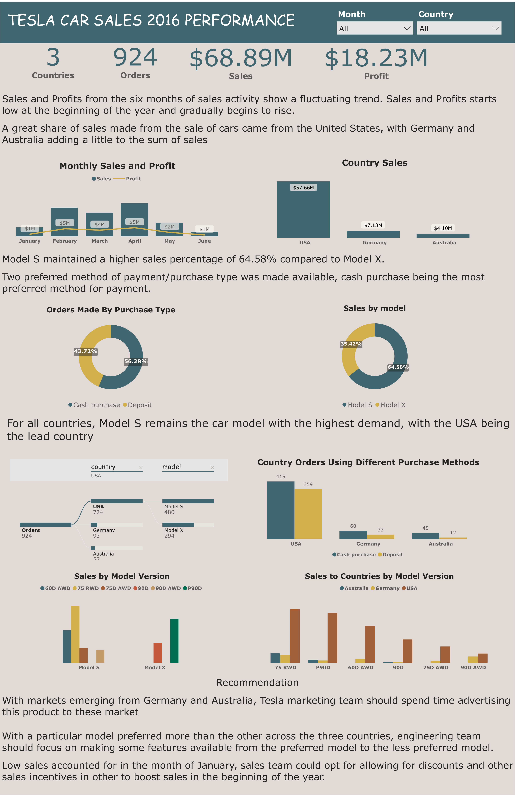

# Tesla Car Sales Dashboard

## Data Source: [Here](https://github.com/VictorOluniyi/Sales-Performance-Dashboard)

 

# Introduction

## The management of tesla Inc decides to analyze historical data of the sale of its car models in the year 2016 for the first six months.

## With the data made available, I have conducted a thorough study of Tesla's historical data for the first six months in 2016. 

 

# Project Objective

## The objective of this report is to provide valuable insights that will help Tesla's management plan better for future production. 

## This report highlights the key attributes of the data, including model, period, country, purchase_type, version, price, and gross profit.

 

# Problem Statement:

## Tesla's management needs to identify the key factors that influenced the company's performance in the first six months of 2016. 

## Additionally, they need to know which models, versions, and purchase types were the most profitable and which countries had the highest demand for Tesla vehicles.
## This information will enable Tesla's management to make informed decisions on future production, including which models to prioritize and which markets to focus on.

 

  

